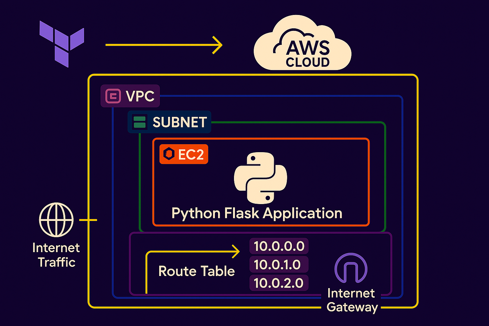

# Flask AWS Terraform Deployment

Deploy a **Python Flask web application** to AWS using **Terraform**. This project automates the provisioning of AWS infrastructure and the deployment of a Flask app on an EC2 instance, following Infrastructure-as-Code and DevOps best practices.

---

## 📦 Project Structure

```
.
├── app/ # Flask application code
│ ├── app.py
│ ├── requirements.txt
│ └── templates/
├── Deployment/ # Terraform IaC files
│ ├── main.tf
│ ├── variables.tf
│ ├── outputs.tf
│ ├── backend.tf
│ ├── key-pair.tf
│ └── vpc.tf
├── .github/workflows/ # GitHub Actions CI/CD
│ ├── terraform.yml
│ └── destroy.yml
├── Makefile # Automation commands
├── .env # Environment variables
├── .gitignore
└── README.md
```

---

---

## 🚀 What Does This Project Do?

- **Provisions AWS infrastructure** (VPC, Subnet, Security Group, EC2, etc.) using Terraform.
- **Deploys a Python Flask app** on an AWS EC2 instance.
- **Automates deployment** via GitHub Actions CI/CD.
- **Manages secrets and keys** securely.
- **Follows DevOps best practices** for reproducibility, automation, and security.

---

## 🖼️ Deployment Architecture

Below is a simplified architecture diagram of the deployment:

---


---

## 🛠️ Prerequisites

- **AWS Account** with access keys
- **AWS CLI** installed and configured
- **Terraform** (v1.0+)
- **Python 3.8+**
- **Git** and **Make**
- (Optional) **Docker** for local testing

---

## ⚙️ Setup & Usage

### 1. Clone the Repository

git clone https://github.com/MannmeetOrg/flask-aws-terraform.git
cd flask-aws-terraform

---

## 🛠️ Prerequisites

- **AWS Account** with access keys
- **AWS CLI** installed and configured
- **Terraform** (v1.0+)
- **Python 3.8+**
- **Git** and **Make**
- (Optional) **Docker** for local testing

---

## ⚙️ Setup & Usage

### 1. Clone the Repository

git clone https://github.com/MannmeetOrg/flask-aws-terraform.git
cd flask-aws-terraform

text

### 2. Configure AWS Credentials

aws configure

text

### 3. Initialize and Apply Terraform

cd Deployment
terraform init
terraform plan
terraform apply

text

- This will provision all AWS resources and output the public IP address of your EC2 instance.

### 4. Deploy Flask Application

The EC2 instance is provisioned with a **user data script** that:
- Installs Python and dependencies
- Clones this repository
- Installs the Flask app and starts it

You can also SSH into the instance (if needed) using the generated key pair.

### 5. Access the Application

- Open your browser and navigate to:  
  http://<EC2-PUBLIC-IP>/

text
(Replace `<EC2-PUBLIC-IP>` with the output from Terraform.)

---

## 👩‍💻 Local Development

1. **Install dependencies:**
   cd app
   pip install -r requirements.txt

text

2. **Run the Flask app locally:**
   python app.py

text

3. **Visit** [http://localhost:5000](http://localhost:5000)

---

## 🧑‍🔬 CI/CD Pipeline

- **GitHub Actions** automates Terraform deployment on push.
- Workflows are defined in `.github/workflows/terraform.yml` and `destroy.yml`.
- Secrets (like AWS keys) are managed in GitHub repository settings.

---

## 🔐 Security & Key Management

- **SSH keys** are managed via Terraform (`key-pair.tf`).
- **Never commit private keys** to the repository.
- Use GitHub Secrets for sensitive values.

---

## 🧹 Clean Up

To destroy all AWS resources:

cd Deployment
terraform destroy

text

---

## 📝 Notes & Best Practices

- **Do not expose your AWS credentials or private keys.**
- **Use remote state storage** (like S3) for Terraform in production.
- **Regularly rotate SSH keys and AWS secrets.**
- **Monitor your AWS resources** for unexpected costs.

---

## 📦 Flask Application

<details> <summary>Show Code</summary>

    ```
        # File: app/app.py
        from flask import Flask, render_template
        from dotenv import load_dotenv
        import os

        load_dotenv()

        app = Flask(__name__)

        @app.route('/')
        def home():
        return render_template('index.html')
        
        @app.route('/health')
        def health():
        return {'status': 'healthy'}, 200
        
        if __name__ == '__main__':
        port = int(os.environ.get('PORT', 5000))
        app.run(debug=False, host='0.0.0.0', port=port)
    ```
</details> ```


## 🔧 Makefile 

 <details>
    <summary>Show Code</summary>

    ```makefile
        .PHONY: install start stop status

        install:
        @echo "Installing Flask application..."
        cd app && pip3 install -r requirements.txt --user
        @echo "Installation completed successfully"
        
        start:
        @echo "Starting Flask application..."
        cd app && nohup python3 app.py > ../app.log 2>&1 &
        @echo "Application started. Check app.log for details"
        
        stop:
        @echo "Stopping Flask application..."
        pkill -f "python3 app.py" || true
        @echo "Application stopped"
        
        status:
        @pgrep -f "python3 app.py" && echo "Application is running" || echo "Application is not running"

    ```
  </details>


## 🚀 Terraform Deployment Steps
🔁 Initialize and Plan (auto-run via GitHub Actions)
* On each push to the main branch:

* Terraform init, validate, plan is run
 
* Plan artifact is saved
 
## ▶️ Manual Apply from GitHub UI
* Go to Actions → Terraform CI/CD - Manual Apply

* Click Run workflow

* This will apply the last plan and deploy EC2 + Flask app

---

## ✅ Output
You’ll see the public IP in GitHub Actions output and in terraform output.

## 🔥 Manual Destroy (Safe)
* To clean up resources manually:
 
* Go to Actions → Terraform Destroy

* Click Run workflow

* This will destroy all deployed resources safely
---
    
## 💡 Customization Ideas
* Replace EC2 with Fargate or Beanstalk

* Add Load Balancer + Route53 DNS
 
* Store Flask code in S3 or ECR

* Use GitHub Environments for approval flows

* Add Terraform remote backend (S3 + DynamoDB locking)

---

## 📜 License
MIT License

---

## 🎓 FOR NEW LEARNERS

You can try with Customerization ideas provided.
Make sure you create your own repo to build with the help of this sample repo.
Writing code by yourself will Guide you more than just copy pasting it.
